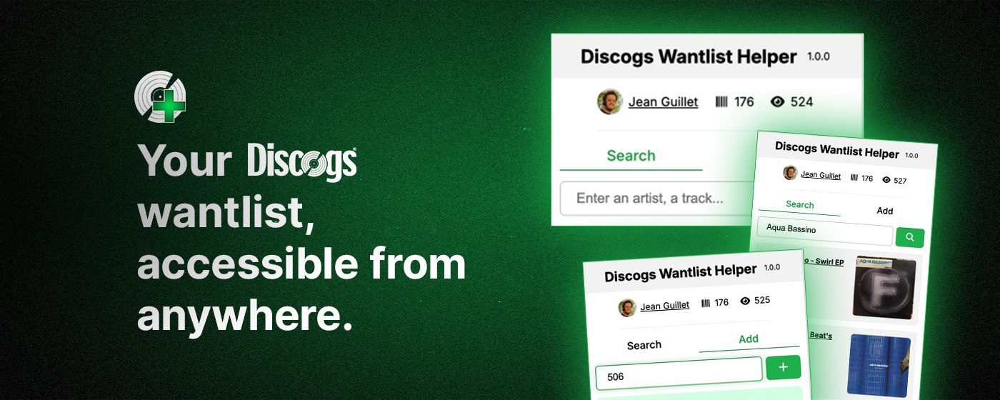

# Discogs Wantlist Helper

Chrome extension to let you add a record to your Discogs wantlist effortlessly. Useful when you're on a website (like YouTube), find a cool record and want to add it right away, without going to the Discogs website.

1. Authorize your Discogs account
2. Type in any artist or track (like `Aqua Bassino`), then browse through the Discogs library to add or remove a release
3. You can also enter any valid Discogs release URL or release ID, to add a release directly
4. The release is now in your wantlist!

For a direct add, the extension currently recognizes the following URLs:

- Discogs URL like `https://www.discogs.com/release/505-Aqua-Bassino-Swirl-EP`
- Youtube redirect URL like `https://www.youtube.com/redirect?event=video_description&q=https%3A%2F%2Fwww.discogs.com%2FCarl-Max-From-Heaven-To-Hell-EP%2Frelease%2F163748`)

Read the [privacy policy](https://jeanguillet.com/discogs_wantlist_helper_privacy_policy)

## Contributing

I'm opened to any suggestions to make the extension better. I'm also working on new features actively. If you notice a bug or want to submit a feature idea, don't hesitate to open an issue or a Pull Request.

## Tools

- [Chrome Extensions Manifest V3](https://developer.chrome.com/docs/extensions/develop/migrate/what-is-mv3?hl=fr)

- [Discogs API](https://api.discogs.com/) (uses OAuth 1.0a)

- [Vite](https://vite.dev/) to bundle the extension

- [Alpine.js CSP (Content-Security Policy) Build](https://alpinejs.dev/advanced/csp) for frontend interactions

## Dev dependencies

- vite
- @crxjs/vite-plugin

## Dependencies

- @alpinejs/csp
- @fortawesome/fontawesome-free

## Run locally

1. The extension relies on the [Discogs Wantlist Helper Server](https://github.com/John35961/discogs-wantlist-helper-server) as a backend. You should first clone that repo, then boot up your local Discogs API wrapper, ensuring it's running at `http://localhost:3000/discogs/api/v1`.

2. Then clone this repo with `git clone git@github.com:John35961/discogs-wantlist-helper.git` then `cd discogs-helper`

3. Install dependencies with `npm install`

4. Build the extension with `npm run build:dev` (development mode), `npm run build:dev:watch` (development mode watching for file changes) or `npm run build:prod` (bundling for production)

5. Then in `chrome://extensions/`, load the generated `/dist` folder as an unpacked extension
